# TattooHub API
A TattooHub API é uma plataforma robusta e dinâmica destinada a conectar tatuadores talentosos com entusiastas de tatuagens. A API oferece uma interface rica e intuitiva para gerenciar perfis de usuários e tatuadores, agendamentos, preferências pessoais e feedback, proporcionando uma experiência personalizada e eficiente para todos os envolvidos.

## Funcionalidades Principais:

- Gerenciamento de Perfil: Criação e manutenção de perfis detalhados de usuários e tatuadores, incluindo biografias, fotos de perfil e dados pessoais.

- Preferências de Tatuagem: Registro das preferências de estilos de tatuagem dos usuários, artistas favoritos e localização preferida para tatuagens.

- Agendamento: Sistema de agendamento de consultas e sessões de tatuagem com acompanhamento do status e notificações automáticas.

- Comunicação: Plataforma de mensagens para facilitar a comunicação direta entre usuários e tatuadores.

- Feedback e Avaliações: Sistema para coleta de feedback e avaliações de artistas, ajudando a manter um alto padrão de qualidade e satisfação do cliente.

- Geolocalização: Funcionalidade de localização para encontrar tatuadores próximos, baseando-se na cidade/estado de residência ou coordenadas de GPS do usuário.

### Objetivo
O principal objetivo da TattooHub API é criar um ecossistema harmonioso onde tatuadores podem se conectar facilmente com novos clientes, e os usuários podem descobrir e agendar sessões com artistas que correspondam às suas preferências e estilos. Através de uma interface amigável e funcionalidades avançadas, a plataforma busca aprimorar a experiência de ambos os lados, promovendo um ambiente seguro, criativo e colaborativo.

--- 
## Database

```mermaid
graph TD;
    User["User"]
    Profile["Profile"]
    Preferences["Preferences"]
    Appointments["Appointments"]
    Feedback["Feedback"]
    Notifications["Notifications"]
    Geolocation["Geolocation"]

    User --> Profile
    User --> Preferences
    User --> Appointments
    User --> Feedback
    User --> Notifications
    User --> Geolocation

    Profile --> |Username| Username["Username"]
    Profile --> |Password| Password["Password"]
    Profile --> |Email| Email["Email"]
    Profile --> |Full Name| FullName["Full Name"]
    Profile --> |Birth Date| Birthdate["Birth Date"]
    Profile --> |Gender| Gender["Gender"]
    Profile --> |Biography| Bio["Biography"]
    Profile --> |Profile Picture| ProfilePic["Profile Picture"]

    Preferences --> |Favorite Styles| FavStyles["Favorite Styles"]
    Preferences --> |Favorite Artists| FavArtists["Favorite Artists"]
    Preferences --> |Preferred Location| PrefLocation["Preferred Location"]
    Preferences --> |Tattoo History| TattooHistory["Tattoo History"]

    Appointments --> |Appointment Date| AppointmentDate["Appointment Date"]
    Appointments --> |Appointment Status| AppointmentStatus["Appointment Status"]
    Appointments --> |Previous Consultations| PreviousConsultations["Previous Consultations"]

    Feedback --> |Messages| Messages["Messages"]
    Feedback --> |Reviews| Reviews["Reviews"]
    Feedback --> |Notification Preferences| NotificationPrefs["Notification Preferences"]

    Notifications --> |Contact Preferences| ContactPref["Contact Preferences"]
    Notifications --> |Notification Frequency| NotificationFrequency["Notification Frequency"]

    Geolocation --> |City/State| Location["City/State"]
    Geolocation --> |GPS Coordinates| GPS["GPS Coordinates"]
```

